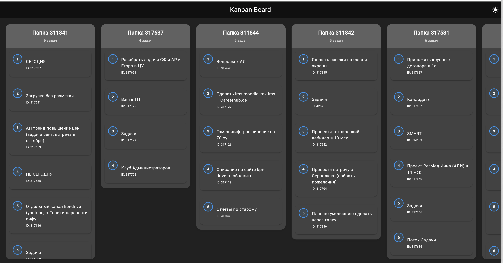
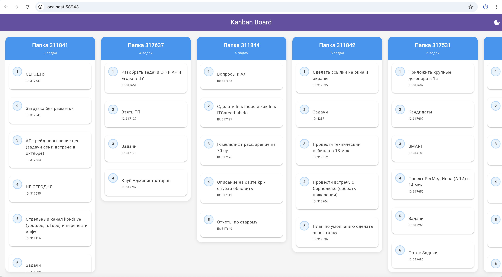

# Проект: KPI Drive Kanban 📊

### Простое управление задачами методом Drag-and-Drop

👋 Добро пожаловать на Kanban-доску KPI Drive! Этот проект представляет собой удобный и отзывчивый интерфейс для просмотра задач и управления ими. Разработанный на **Flutter**, он обеспечивает плавный, нативный опыт **перетаскивания (drag-and-drop)**, работающий отлично даже в веб-браузере.

Ключевая цель — дать пользователям возможность легко **менять статус и порядок** задач, при этом все изменения немедленно сохраняются через API.

## 📸 Скриншоты


<div align="center">

|                                                | |
|:----------------------------------------------:|:-------------------------:|
|        **Loading Data** <br> Dark Theme        | **Main Screen** <br> Light Theme |
|  |  |

 

</div>
---

## ✨ Основные возможности

* **Drag & Drop Simplicity:** Легко перемещайте задачи между колонками (смена статуса) или меняйте их приоритет.
* **Оптимистичный UI:** Изменения на экране происходят мгновенно, с последующим фоновым сохранением. При неудачном сохранении задача **плавно возвращается** на исходное место.
* **Чистая архитектура:** Четкое разделение логики на UI, управление состоянием (**`KanbanProvider`**) и взаимодействие с API (**`ApiService`**).

---

## 🛠️ Начало работы (Для разработчиков)

### Необходимые инструменты

* **Flutter SDK:** Последняя стабильная версия.
* **Dart SDK:** Входит в состав Flutter.

### Установка и запуск

1.  **Клонируйте репозиторий:**
    ```bash
    git clone https://github.com/muhammadmajd/Kanban-Board.git
    cd Kanban-Board
    ```

2.  **Загрузите зависимости:**
    ```bash
    flutter pub get
    ```

3.  **Запустите приложение (рекомендуется Web):**
    ```bash
    flutter run -d chrome
    ```

---

## 🧪 Тестирование (Unit и Widget Tests)

Проект использует **модульные тесты (Unit Tests)** для проверки логики провайдеров и сервисов, и **виджет-тесты (Widget Tests)** для проверки взаимодействия UI с провайдерами.

### 1. Подготовка (Генерация Моков)

Перед запуском тестов необходимо сгенерировать классы-заглушки для **`ApiService`** и **`http.Client`** с помощью пакета `mockito`.

```bash
# Эта команда генерирует MockApiService и MockClient
flutter pub run build_runner build --delete-conflicting-outputs
```
### 2. Запуск Тестов
Юнит-тесты проверяют логику провайдеров (например, KanbanProvider.moveTask).

Виджет-тесты проверяют реакцию UI на изменения состояния (например, ThemeProvider).


# Запуск всех тестов в проекте:
flutter test 

# Запуск тестов конкретного файла (рекомендуется):
flutter test unit_test/provider/kanban_provider_test.dart
flutter test unit_test/provider/theme_provider_test.dart
.....